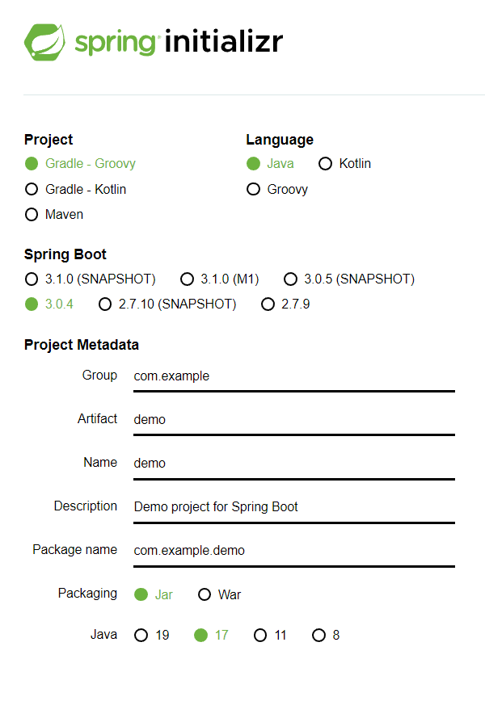
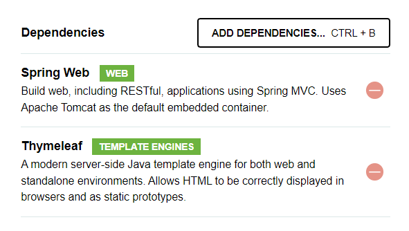

# 스프링 입문
## 목차

> 230318
## 섹션 1. 프로젝트 환경 설정
### 프로젝트 생성
- Java는 11로
#### [스프링 부트 스타터 사이트](https://start.spring.io)
- 예전에는 하나하나 손으로 직접 빌드했으나 요즘은 스프링 부트 스타터 사이트를 사용해 보다 쉽게 작업
- 스프링 부트 기반으로 스프링 관련 프로젝트를 만들어주는 사이트  

- SNAPSHOT 이나 M1은 정식 릴리즈 버전이 아님
- Dependencies
  - 
  - 스프링 부트에서 어떤 라이브러리를 땡겨서 쓸건지
  - Spring web - 스프링 웹 프로젝트를 위한 라이브러리
  - Thymeleaf - HTML 템플릿 엔지니어 
#### 프로젝트 파일
- test code
  - 요즘 개발 트렌드에서 정말 중요한 코드
- resource
  - 자바 파일을 제외한 나머지는 전부 resource
- bulid.gradle
  - 다양한 설정이 들어간 파일
- .gitignore
  - git에는 소스파일만 올라가야기에 미리 설정되어 있는 내용
- gradlew, gradlew.bat
  - gradle 관련 파일

### 라이브러리 살펴보기
#### 스프링부터 라이브러리
- spring-boot-starter-web
  - spring-boot-starter-tomcat: 톰캣 (웹서버)
  - spring-webmvc: 스프링 웹 MVC
- spring-boot-starter-thymelaef : 타임리프 템플릿 엔진
- spring-boot-starter(공통) : 스프링부트 + 스프링코어 + 로깅
  - 스프링 관련 라이브러리를 하나 가져오면 연관 있는 라이브러리를 함께 가져옴
  - spring-boot
    - spring-core
  - spring-boot-starter-logging
    - logback, slf4j
#### 테스트 라이브러리
- spring-boot-starter-test
   - junit : 테스트 프레임워크
   - mockito: 목 라이브러리
   - assertj: 테스트 코드를 좀 더 편하게 작성하게 도와주는 라이브러리
   - spring-test: 스프링 통합 테스트 지원

### View 환경설정
#### Welcome page
- resource 폴더에 index.html 파일을 생성하면 Welcome page가 생성됨
- [welcome page 관련 docs](https://docs.spring.io/spring-boot/docs/2.3.1.RELEASE/reference/html/spring-boot-features.html#boot-features-spring-mvc-welcome-page)

### 빌드하고 실행하기
1. 콘솔로 이동 명령 프롬프트(cmd)로 이동
2. ./gradlew gradlew.bat 를 실행
3. .\gradlew build
  - 폴더 목록 확인 ls 나 dir로 가능
4. 생성된 bulid 폴더의 libs로 이동
5. jar 파일을 실행시키면 서버 실행됨
- 배포 빌드 후 생성된 jar 파일만 배포하면 spring 구현이 문제 없게 돌아감